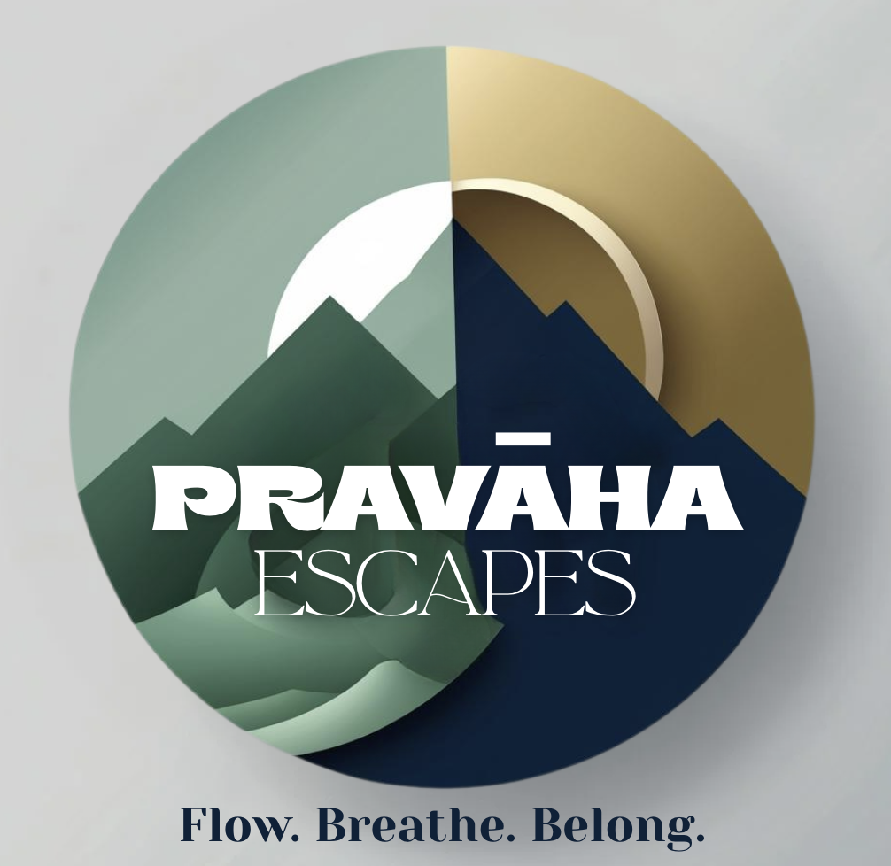

<!doctype html>
<html lang="en">
<head>
  <meta charset="utf-8" />
  <meta name="viewport" content="width=device-width,initial-scale=1" />
  <title>Prāvaha Escapes — Flow. Breathe. Belong.</title>
  <meta name="description" content="Prāvaha Escapes — curated weekend treks, corporate offsites and wellness retreats around Mumbai & Pune." />

  <!-- Fonts -->
  <link href="https://fonts.googleapis.com/css2?family=Poppins:wght@300;400;600&family=Playfair+Display:wght@400;600;700&display=swap" rel="stylesheet">

  
</head>
<body>

  <!-- NAV -->
  <nav>
    

      <!-- ensure your logo filename is exactly logo.png and uploaded to repo root -->
      
      

        
Prāvaha Escapes

        
Flow. Breathe. Belong.

      

    

    

      

        <a href="#home">Home</a>
        <a href="#about">About</a>
        <a href="#events">Our Escapes</a>
        <a href="#gallery">Gallery</a>
        <a href="#testimonials">Testimonials</a>
        <a href="#contact">Contact</a>
      

      <button class="hamburger" id="hamburger" aria-label="Open menu">☰</button>
    

  </nav>

  <!-- MOBILE MENU (hidden by default) -->
  

    <a href="#home" style="display:block;padding:10px 0;border-bottom:1px solid #f1f1f1">Home</a>
    <a href="#about" style="display:block;padding:10px 0;border-bottom:1px solid #f1f1f1">About</a>
    <a href="#events" style="display:block;padding:10px 0;border-bottom:1px solid #f1f1f1">Our Escapes</a>
    <a href="#gallery" style="display:block;padding:10px 0;border-bottom:1px solid #f1f1f1">Gallery</a>
    <a href="#testimonials" style="display:block;padding:10px 0;border-bottom:1px solid #f1f1f1">Testimonials</a>
    <a href="#contact" style="display:block;padding:10px 0">Contact</a>
  

  <!-- HERO -->
  <header class="hero" id="home">
    

      <h1>Weekend escapes & corporate retreats crafted with care</h1>
      
Short treks, wellness retreats and experiential workshops to help teams reset and recharge — without the hassle.

      

        <a class="btn" href="#events">View Escapes</a>
        <a class="btn secondary" href="#contact">Request Quote</a>
      

    

  </header>

  <!-- ABOUT -->
  <section id="about" class="reveal">
    

      <h2>About</h2>
      
Curated experiences across Maharashtra

    

    

      Prāvaha Escapes blends experienced guides and corporate facilitators to design meaningful offsites, wellness weekends and active escapes. We focus on safety, sustainability and outcomes — whether it’s leadership sprints, trail recovery sessions, or creative workshops.
    

  </section>

  <!-- EVENTS -->
  <section id="events" class="reveal">
    

      <h2>Our Escapes</h2>
      
Small groups · Expert guides

    

    

      <article class="card">
        
        <h3 style="margin-top:10px">Kalsubai Sunrise Trek</h3>
        
Sunrise summit, camp breakfast and reflection session.

      </article>

      <article class="card">
        
        <h3 style="margin-top:10px">Corporate Offsite — Reset</h3>
        
Strategy sprints, team games and guided facilitation.

      </article>

      <article class="card">
        
        <h3 style="margin-top:10px">Pottery & Creativity Day</h3>
        
Hands-on workshop to slow down, create and reconnect.

      </article>
    

  </section>

  <!-- GALLERY -->
  <section id="gallery" class="reveal">
    

      <h2>Gallery</h2>
      
Moments from our escapes

    

    

      
      
      
      
    

  </section>

  <!-- TESTIMONIALS -->
  <section id="testimonials" class="reveal">
    

      <h2>Testimonials</h2>
      
Real feedback from teams

    

    

      

        
“Prāvaha organised an unforgettable offsite — logistics and facilitation were seamless.”

        
— Product Team, Fintech

      

      

        
“The cold-plunge session was transformative — perfect mix of science & calm.”

        
— Rahul S.

      

    

  </section>

  <!-- CONTACT -->
  <section id="contact" class="reveal">
    

      <h2>Contact</h2>
      
Tell us about your team — we’ll reply in 24 hours

    

    

      

        <!-- REPLACE with your Formspree endpoint or backend URL -->
        <form id="contactForm" action="https://formspree.io/f/your-form-id" method="POST">
          <label class="muted">Name</label>
          <input type="text" name="name" required placeholder="Your name">
          <label class="muted">Work Email</label>
          <input type="email" name="email" required placeholder="you@company.com">
          <label class="muted">Phone</label>
          <input type="tel" name="phone" placeholder="+91 9xxxxxxxxx">
          <label class="muted">Message</label>
          <textarea name="message" rows="4" placeholder="Dates, team size, goals..."></textarea>

          

            <button class="btn" type="submit">Send Enquiry</button>
            <a class="btn" href="mailto:hello@pravaha.example" style="background:transparent;color:var(--navy);border:1px solid #e9e9e9">Email</a>
          

          
We will contact you within 24 hours.

        </form>
      

    

  </section>

  <!-- WhatsApp -->
  <a class="whatsapp" href="https://wa.me/91XXXXXXXXXX?text=Hello%20Pravaha%20Escapes%2C%20I%20am%20interested%20in%20your%20packages." aria-label="Chat on WhatsApp">💬</a>

  <!-- Footer -->
  <footer>
    

      

        
Prāvaha Escapes

        
©  Flow. Breathe. Belong.

        
<a href="https://instagram.com/YOUR_INSTAGRAM" target="_blank" rel="noopener">Instagram</a>

      

    

  </footer>

  <!-- Scripts -->
  
</body>
</html>
